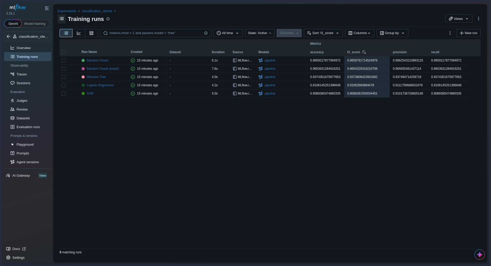
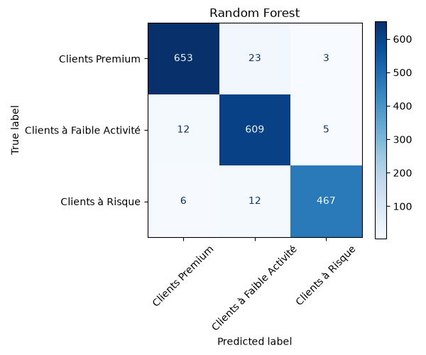

# CardProfiler — Credit card customer segmentation

Segmentation of ~9,000 credit card clients from their usage behavior (balance, purchases, cash advances, payments), followed by a supervised model that predicts the segment of a new client. Experiments are tracked with MLflow and the model is demoed in a Streamlit app.

## Pipeline

1. **EDA**: data quality, distributions, correlations, outliers.
2. **Preprocessing**: `df_clean`, then a separate clustering branch (log1p, StandardScaler, PCA).
3. **Clustering**: K-means and DBSCAN grid searches. K-means was kept (k=3, 2 PCA components, silhouette 0.449, balanced clusters, 100% coverage).
4. **Interpretation**: clusters named from their mean profiles, stored in the `target` column.
5. **Classification**: scikit-learn pipelines (StandardScaler + classifier), cross-validation, GridSearchCV. Best model: Random Forest (F1 ≈ 0.966).
6. **MLflow**: one run per model (params, metrics, pipeline, confusion matrix).
7. **Streamlit**: predicts the segment of a client from raw values.

### Segments

| Segment | Profile | Share |
|---|---|---|
| Clients Premium | High purchases, high credit limit, high payments | ~38% |
| Clients à Faible Activité | Low balance, low spending, low credit limit | ~35% |
| Clients à Risque | Very low purchases, heavy cash advances | ~27% |

## Project structure

```
CardProfiler/
├── app/app.py               # Streamlit app
├── data/
│   ├── raw/                 # original dataset (not versioned)
│   └── processed/           # df_clean (generated, not versioned)
├── docs/                    # MLflow and app screenshots
├── models/
│   └── best_pipeline.joblib # saved pipeline (scaler + Random Forest)
├── notebooks/
│   ├── EDA.ipynb
│   ├── Preprocessing.ipynb
│   ├── Clustering.ipynb
│   ├── Classification.ipynb
│   └── MLflow.ipynb
├── src/cardprofiler/
│   ├── preprocessing.py
│   ├── clustering.py
│   └── classification.py
├── pyproject.toml
├── uv.lock
└── README.md
```

## Installation

Requires [uv](https://docs.astral.sh/uv/).

```bash
git clone git@github.com:ABDELHAFIDaz/CardProfiler.git
cd CardProfiler
uv sync
```

## Data

The dataset is not versioned. Put the original CSV in `data/raw/` before running the notebooks.

## Running the project

Open the notebooks with the project's `.venv` kernel and run them in this order:

1. `EDA.ipynb`
2. `Preprocessing.ipynb` (creates `data/processed/df_clean.csv`)
3. `Clustering.ipynb` (adds the cluster columns and the `target` column)
4. `Classification.ipynb` (trains the models and saves `models/best_pipeline.joblib`)
5. `MLflow.ipynb` (logs one run per model)

The reusable code lives in `src/cardprofiler/`, for example:

```python
from cardprofiler.classification import split_data, build_pipeline, evaluate
```

## MLflow

```bash
uv run mlflow ui --backend-store-uri sqlite:///mlflow.db
```

Open http://127.0.0.1:5000, go to the `classification_clients` experiment, and sort the runs by `f1_score`. Run data is stored in `mlflow.db` and artifacts in `mlruns/` (both generated, not versioned).




## Streamlit app

```bash
uv run streamlit run app/app.py
```

The app loads `models/best_pipeline.joblib` and calls `pipeline.predict()` on raw values. The scaling happens inside the pipeline, so it is not re-coded in the app.

## Design decisions

- **Two branches from `df_clean`.** Log, scaling and PCA are only used for clustering. Classification starts from the raw `df_clean`, so no clustering transformation leaks into it.
- **No leakage in `X`.** `target` and all cluster columns are excluded from the features.
- **Single pipeline.** The scaler is learned on the training data only, and refit on each fold during cross-validation.
- **K-means over DBSCAN.** DBSCAN was not clearly better (silhouette 0.453 vs 0.449) and only found 2 clusters plus noise.
- **No resampling.** Class proportions (27% to 38%) are mild, so SMOTE was not needed.